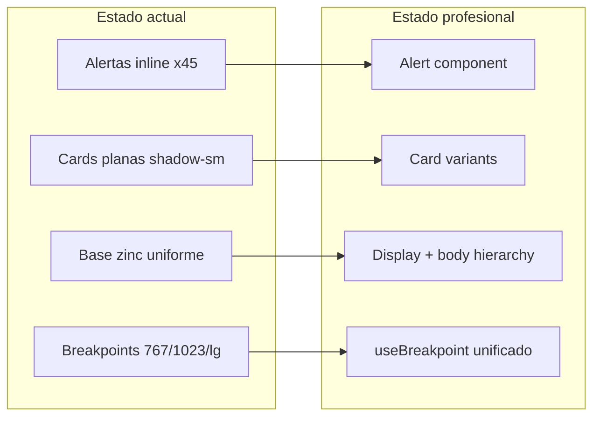

# Auditoría Frontend — GymApure (Caribean Gym)

**Fecha:** 2026-07-11  
**Versión auditada:** GymApure v2.5.0  
**Alcance:** Frontend completo — todos los roles (admin, trainer, member, receptionist)  
**Metodología:** Revisión estática de código + validación cruzada con tests Playwright existentes  
**Entregable:** Informe de hallazgos y recomendaciones (sin cambios de código)

### Checklist de validación (todos del plan)

| Todo | Estado | Sección |
|------|--------|---------|
| Documentar breakpoints 767px vs 1023px | Completado | §1 |
| Confirmar doble fetch Equipment y Notifications | Completado | §2 |
| Probar gaps responsive (Profile, WorkoutHistory, AdminDashboard) | Completado | §3 |
| Auditar z-index y scroll lock en modales | Completado | §4 |
| Inventariar duplicaciones Alert/Card inline | Completado | §6 |

---

## Resumen ejecutivo

El frontend de GymApure es un SPA React 19 bien estructurado con design system propio, shells móviles por rol y TanStack Query en la mayoría de listados. La auditoría confirmó **3 hallazgos de severidad alta** (breakpoints inconsistentes, doble fetch en Equipment, ResponsiveTable sin uso), **5 de severidad media** (queries duplicadas, loading bloqueante, modales fragmentados) y oportunidades claras de elevación visual hacia un producto más profesional.

| # | Hallazgo | Severidad | Estado |
|---|----------|-----------|--------|
| 1 | Breakpoints inconsistentes (767 vs 1023 vs Tailwind) | Alta | Confirmado |
| 2 | Equipment doble fetch al montar | Alta | Confirmado |
| 3 | ResponsiveTable existe pero no se usa | Alta | Confirmado |
| 4 | Profile bloquea por 3 queries + tabla no responsive | Media | Confirmado |
| 5 | Notifications — hasta 3 requests API al cargar | Media | Confirmado |
| 6 | 3 implementaciones de diálogos (Modal/Sheet) | Media | Confirmado |
| 7 | Settings spinner bloquea toda la página | Media | Confirmado |
| 8 | Sin componente Alert — 15+ duplicaciones | Media | Confirmado |
| 9 | Cards/boxes inconsistentes (radius, shadow) | Baja | Confirmado |
| 10 | Copy Profile apariencia referencia sidebar inexistente en móvil | Baja | Confirmado |

---

## 1. Validación de breakpoints (767px vs 1023px)

### Fuentes detectadas

| Fuente | Media query | Archivos |
|--------|-------------|----------|
| `useIsMobile()` | `max-width: 767px` | [`src/hooks/useIsMobile.ts`](../src/hooks/useIsMobile.ts) |
| Shell móvil | `max-width: 1023px` | [`src/components/Layout.tsx`](../src/components/Layout.tsx), [`src/pages/Reception.tsx`](../src/pages/Reception.tsx), [`src/components/reception/ReceptionHomeSummary.tsx`](../src/components/reception/ReceptionHomeSummary.tsx) |
| Desktop notifications | `min-width: 1024px` | [`src/components/notifications/NotificationPanel.tsx`](../src/components/notifications/NotificationPanel.tsx) |
| Kiosk check-in | `min-width: 1024px` | [`src/pages/CheckIn.tsx`](../src/pages/CheckIn.tsx) |
| Tailwind `md:` | 768px | Varios |
| Tailwind `lg:` | 1024px | Varios |
| CSS global | `max-width: 1023px` | [`src/index.css`](../src/index.css) línea 153 |

### Zona tablet (768–1023px) — comportamiento validado

En un iPad (834×1194, proyecto Playwright `tablet`):

| Componente | Comportamiento en tablet | Breakpoint usado |
|------------|--------------------------|------------------|
| Layout shell | Bottom nav + header móvil | 1023px |
| Members | Cards móviles, tabla oculta | `lg` (1024px) |
| Payments | Cards móviles, tabla oculta | `lg` (1024px) |
| WorkoutHistory | **Tabla desktop visible** | `md` (768px) |
| ActiveWorkout pager/foco | **Comportamiento desktop** (sin pager) | 767px |
| NotificationPanel | Sheet superior (no modal) | 1024px |

**Test automatizado existente** ([`tests/ux/tablet-staff.tablet.spec.ts`](../tests/ux/tablet-staff.tablet.spec.ts)):

```typescript
// 834px: tabla desktop oculta en /members
await expect(page.locator('.table-shell')).toBeHidden();
```

Esto confirma que en tablet el admin ve cards en Members, no tabla — coherente con `lg:` pero **inconsistente** con WorkoutHistory que ya muestra tabla desde 768px.

### Impacto en ActiveWorkout (bug confirmado)

`useIsMobile()` controla en [`src/pages/ActiveWorkout.tsx`](../src/pages/ActiveWorkout.tsx):

- Pager inferior de ejercicios (`isMobileFocus && routine.exercises.length > 1`)
- Auto-avance al siguiente ejercicio tras completar serie
- Padding inferior (`pb-36` vs `pb-20`)
- Ocultar ejercicios no enfocados (`hidden` cuando `index !== focusedIndex`)

En tablet (768–1023px):
- El usuario ve **bottom nav** del shell móvil (Layout a 1023px)
- Pero ActiveWorkout trata el viewport como **desktop** (767px no alcanza)
- Resultado: lista completa de ejercicios sin pager, sin auto-avance, layout menos optimizado para touch

### Recomendación

Unificar en `useBreakpoint()` con tokens:

```
mobile:   width < 768px
tablet:   768px ≤ width < 1024px
desktop:  width ≥ 1024px
```

Reemplazar `useIsMobile` y las 6 instancias de `useMediaQuery` hardcodeadas. Alinear `ResponsiveTable` y páginas de listado al mismo breakpoint (`lg` recomendado para tablas densas).

---

## 2. Validación de dobles cargas y queries

### 2.1 Equipment — doble fetch confirmado

**Archivo:** [`src/pages/Equipment.tsx`](../src/pages/Equipment.tsx)

**Flujo al montar la página:**

```
Effect 1 (deps: [])
  └─ setLoading(true)
  └─ Promise.all([loadMeta(), loadInventory()])
       └─ GET /api/equipment?          ← Request #1
  └─ setLoading(false)

Effect 2 (deps: [debouncedSearch, loadInventory, loading])
  └─ if (loading) return
  └─ loadInventory()
       └─ GET /api/equipment?          ← Request #2 (idéntico si search vacío)
```

**Evidencia en código:**

```typescript
// Effect 1 — líneas 383-398
useEffect(() => {
  setLoading(true);
  void Promise.all([loadMeta(), loadInventory()])...
}, []);

// Effect 2 — líneas 400-403
useEffect(() => {
  if (loading) return;
  void loadInventory();
}, [debouncedSearch, loadInventory, loading]);
```

**Impacto:** 2 requests idénticos a `/api/equipment` en cada visita sin búsqueda activa. Además `loadMeta()` dispara 2–3 requests adicionales (zones, catalog, vendors).

**Fix sugerido:** Eliminar `loadInventory()` del Effect 1; dejar solo `loadMeta()`. El Effect 2 cubre la carga inicial cuando `loading` pasa a `false`. O migrar a React Query con `queryKey: ['equipment', debouncedSearch]`.

---

### 2.2 Notifications — queries superpuestas confirmadas

**Archivo:** [`src/pages/Notifications.tsx`](../src/pages/Notifications.tsx)

Al cargar la página se ejecutan **3 requests** distintos:

| Hook | Endpoint | Parámetros |
|------|----------|------------|
| `useNotificationUnreadQuery` | `GET /api/notifications/unread-count` | — |
| `useNotificationsPanelQuery` (vía `useNotificationItems`) | `GET /api/notifications` | `page=1, limit=10, unread_only=true` |
| `useNotificationsQuery` | `GET /api/notifications` | `page=1, limit=20` (+ unread_only si filtro activo) |

**Evidencia** en [`src/hooks/queries/useNotificationsQuery.ts`](../src/hooks/queries/useNotificationsQuery.ts):

```typescript
// Panel query — línea 42
queryFn: () => fetchNotifications(1, 10, true),

// List query — línea 51
queryFn: () => fetchNotifications(page, 20, unreadOnly),
```

`useNotificationItems` también dispara queries de rol (chat unread, trainer stats, reception stats) para ítems "live", aunque en la página de Notifications solo se usan `liveItems` y `unreadPersisted` parcialmente.

**Impacto:** Redundancia de datos entre panel query y list query; el usuario espera una sola fuente de verdad.

**Fix sugerido:** En la página Notifications, no invocar `useNotificationItems` completo; usar solo `useNotificationsQuery` + `useNotificationUnreadQuery`. O compartir cache con `queryKey` padre `['notifications']` y prefetch.

---

### 2.3 Otros patrones de carga

| Página | Patrón | Issue |
|--------|--------|-------|
| [`Dashboard.tsx`](../src/pages/Dashboard.tsx) | `DashboardSkeleton` → Suspense → otro `DashboardSkeleton` | Doble flash de skeleton |
| [`Profile.tsx`](../src/pages/Profile.tsx) | 3 queries paralelas bloquean toda la página | UX lenta en tab "Datos" |
| [`Settings.tsx`](../src/pages/Settings.tsx) | Spinner global hasta cargar expiry settings | Push y métricas invisibles |
| [`MemberRoutine.tsx`](../src/pages/MemberRoutine.tsx) | 4 `apiFetch` sin React Query | Sin cache ni deduplicación |

### 2.4 Patrones de fetch inconsistentes (confirmado)

| Página | Patrón | Problema |
|--------|--------|----------|
| Members, Payments, Routines | React Query hooks | Cache + invalidación vía Socket |
| Equipment, Settings, AuditLogs, Reports | `useEffect` + `apiFetch` | Sin cache, refetch manual |
| MemberRoutine | 4 `apiFetch` paralelos al montar | Sin stale-while-revalidate |

**Recomendación:** Estandarizar listados en React Query; reservar `useEffect` para polling y side-effects.

### 2.5 Efectos con dependencias incompletas (confirmado)

| Archivo | Issue | Riesgo |
|---------|-------|--------|
| [`ActiveWorkout.tsx`](../src/pages/ActiveWorkout.tsx) ~190 | `startSession` ausente en deps del auto-start | Mitigado por `isStartingRef`, frágil ante refactors |
| [`Messages.tsx`](../src/pages/Messages.tsx) ~507 | `markRead` re-ejecuta al cambiar `messagesData?.messages.length` | PATCH redundantes durante polling/streaming |

---

## 3. Validación responsive — gaps confirmados

### Viewports de referencia

| Viewport | Dispositivo | Proyecto Playwright |
|----------|-------------|---------------------|
| 390×844 | iPhone 14 | `mobile` |
| 834×1194 | iPad | `tablet` |
| 1280×720 | Desktop | `desktop` |

### Profile — tabla de mediciones (confirmado no responsive)

**Archivo:** [`src/pages/Profile.tsx`](../src/pages/Profile.tsx) ~líneas 749-751

```html
<div className="-mx-1 overflow-x-auto px-1">
  <table className="w-full min-w-[28rem] text-left">
```

- 6 columnas (Fecha, Peso, Grasa, Cintura, Brazo, Pierna)
- `min-w-[28rem]` = 448px mínimo
- **Sin variante móvil** (cards/lista)
- En iPhone 14 (390px): scroll horizontal obligatorio

**Recomendación:** Cards apiladas en `<md`, similar a `MemberCardMobile.tsx`.

---

### WorkoutHistory — modal con grid rígido (confirmado)

**Archivo:** [`src/pages/WorkoutHistory.tsx`](../src/pages/WorkoutHistory.tsx) ~línea 577

```html
<div className="grid grid-cols-3 gap-2">
```

Tres stat boxes (Series hechas, Series planeadas, Volumen total) sin `sm:grid-cols-1` ni apilado. En móvil estrecho las etiquetas (`text-[10px]`) se comprimen.

**Lista principal:** usa `md:hidden` / `hidden md:block` — **correcto** en 768px, pero inconsistente con Members/Payments que usan `lg`.

---

### AdminDashboard — quick actions (confirmado)

**Archivo:** [`src/pages/admin/AdminDashboard.tsx`](../src/pages/admin/AdminDashboard.tsx) ~línea 193

```html
<div className="grid grid-cols-4 gap-1.5 sm:grid-cols-2 sm:gap-3 lg:grid-cols-5">
```

- En `<640px`: 4 columnas con `iconOnlyMobile` en QuickAction — funcional pero apretado
- En tablet 834px: 2 columnas (`sm:grid-cols-2`) — aceptable
- En desktop 1280px: 5 columnas — correcto

**Riesgo bajo** gracias a `iconOnlyMobile`, pero textos descriptivos ocultos en móvil pequeño.

---

### Matriz responsive por página

| Página | Split breakpoint | Tablet 834px | Móvil 390px |
|--------|------------------|--------------|-------------|
| Members | `lg` (1024) | Cards | Cards |
| Payments | `lg` (1024) | Cards | Cards |
| WorkoutHistory | `md` (768) | Tabla | Cards |
| Profile mediciones | Ninguno | Scroll horizontal | Scroll horizontal |
| Routines calendario | `xl` (1280) | Vista semana | Vista semana |
| Messages | `lg` (1024) | Toggle lista/chat | Toggle lista/chat |

### ResponsiveTable — sin adopción

**Archivo:** [`src/components/ResponsiveTable.tsx`](../src/components/ResponsiveTable.tsx)

- Split en `md` (768px)
- **0 imports** en todo el proyecto
- Cada página reinventa el patrón con breakpoints distintos

---

## 4. Auditoría de modales y z-index

### Implementaciones de diálogo

| Tipo | Componente | Backdrop click | Focus trap | Scroll lock |
|------|------------|----------------|------------|-------------|
| Modal central | `ui/Modal.tsx` | No | Sí | `body.overflow = hidden` |
| Bottom sheet | `MemberBottomNav`, `StaffBottomNav` | Sí | Parcial (Escape) | No |
| Top sheet | `NotificationPanel` (móvil) | Sí | Parcial | No |
| Fullscreen | `MemberBadgeScanView` | No | No | `body.overflow = hidden` |

### Escala z-index documentada (auditada)

| Capa | z-index | Archivo |
|------|---------|---------|
| Bottom nav backdrop | 45 | `MemberBottomNav.tsx`, `StaffBottomNav.tsx` |
| Bottom nav sheet | 46 | mismo |
| Mobile header sticky | 50 | `Layout.tsx` |
| Sidebar drawer | 40 (60 cuando abierto) | `Layout.tsx` |
| Offline banner | 55 | `OfflineBanner.tsx` |
| Notification sheet backdrop | 55 | `NotificationPanel.tsx` |
| Notification sheet content | 56 | `NotificationPanel.tsx` |
| Mobile bottom nav bar | 55 | `Layout.tsx` |
| Workout celebration | 60 | `WorkoutCelebration.tsx` |
| Modal / Badge scan | 80 | `Modal.tsx`, `MemberBadgeScanView.tsx` |
| AnchoredMenu | 80 | `AnchoredMenu.tsx` |
| Toast | 100 | `ToastContext.tsx` |
| Progress bar | 100 | `ProgressBar.tsx` |
| Skip link (focus) | 100 | `Layout.tsx` |

### Conflictos confirmados

**1. Scroll lock compartido**

Tres componentes escriben `document.body.style.overflow`:

- [`Layout.tsx`](../src/components/Layout.tsx) líneas 130-138 — cuando sidebar abierto
- [`Modal.tsx`](../src/components/ui/Modal.tsx) líneas 85-117 — cuando modal abierto
- [`MemberBadgeScanView.tsx`](../src/components/member/MemberBadgeScanView.tsx) líneas 26-38

**Escenario problemático:** Usuario abre sidebar → `overflow: hidden`. Abre modal → sobrescribe. Cierra modal → restaura `overflow: ''` aunque sidebar sigue abierto → **scroll del body se reactiva con drawer visible**.

**2. Modal sin backdrop click**

El overlay en `Modal.tsx` (línea 123-128) no tiene `onClick={onClose}`. Solo botón X y Escape. Fricción en móvil donde el gesto de tap fuera es esperado.

**3. Teclado móvil agresivo**

`initialFocus` default es `'input'` — al abrir modales con campos, el teclado se abre automáticamente. Algunas páginas ya usan `initialFocus="dialog"` correctamente (Members, Equipment, MemberRoutine).

### Recomendaciones

1. Crear primitivo `Sheet` compartido con Modal (focus trap, z-index, scroll lock coordinado)
2. Scroll lock con contador de referencias (`useScrollLock()`) en lugar de asignación directa
3. Documentar escala z-index en `index.css` o design tokens
4. Backdrop click con guard en formularios dirty

---

## 5. Ajustes (Settings)

### Admin — [`src/pages/Settings.tsx`](../src/pages/Settings.tsx)

| Sección | Comportamiento auditado |
|---------|----------------------|
| Expiry alerts | Bloquea página con `<Spinner />` hasta responder |
| Exchange rate | Carga en paralelo, no desbloquea spinner |
| Ops metrics | Poll cada 30s, invisible durante spinner global |
| Push toggle | Renderizado solo post-spinner |

**Recomendación:** Skeleton por `<Card>`; renderizar push y métricas inmediatamente.

### Usuario — [`src/pages/Profile.tsx`](../src/pages/Profile.tsx)

| Pestaña | Hallazgo |
|---------|----------|
| `apariencia` | Copy líneas 884-889 dice "menú lateral" — miembros móviles usan header, no sidebar |
| `apariencia` | `ThemePalettePicker` OK; falta toggle claro/oscuro inline |
| `progreso` | Tabla no responsive (ver sección 3) |
| General | `loading = profileLoading \|\| measLoading \|\| histLoading` bloquea todo |

---

## 6. Inventario design system — duplicaciones

### Componente Alert — NO EXISTE

Patrón de error banner duplicado en **5 archivos** con clases idénticas:

```
rounded-xl border border-red-500/20 bg-red-500/10 p-3 text-sm text-red-600
```

| Archivo | Variante |
|---------|----------|
| `src/pages/Login.tsx` | error |
| `src/pages/Register.tsx` | error |
| `src/pages/ForgotPassword.tsx` | error + success |
| `src/pages/ResetPassword.tsx` | error + success |
| `src/pages/Reception.tsx` | error + success |

**Patrones semánticos adicionales** (no son alertas de formulario pero repiten el mismo lenguaje visual):

| Categoría | Archivos | Ocurrencias aprox. |
|-----------|----------|-------------------|
| Error/success banners inline | 5 páginas auth + Reception | 7 |
| Alertas de estado (expiry, dashboard) | `expiryUtils.ts`, `AdminDashboard.tsx`, `Reports.tsx` | 4 |
| Toast variants | `ToastContext.tsx` | 4 |
| Badge/StatCard tones | `Badge.tsx`, `StatCard.tsx`, `QuickAction.tsx` | Centralizado |
| Hover estados rojo/verde | 15+ archivos (tablas, acciones) | ~30 |
| **Total patrones duplicables** | — | **~45 instancias** |

**Único centralizado:** [`src/lib/expiryUtils.ts`](../src/lib/expiryUtils.ts) — función `expiryBannerClasses()`.

---

### Card/Box — duplicaciones inline

| Patrón canónico (`Card.tsx`) | `rounded-xl shadow-sm border` |
| Patrón auth | `rounded-2xl shadow-xl` — Login, Register |
| Patrón inline duplicado | `rounded-2xl border border-zinc-200 bg-white p-* dark:bg-zinc-900` |

**Archivos con card inline (no usan `<Card>`):**

| Archivo | Clases |
|---------|--------|
| `src/pages/AccessDenied.tsx` | `rounded-2xl border … p-6` |
| `src/pages/Notifications.tsx` | `rounded-2xl border … p-8` (loading) |
| `src/components/notifications/NotificationPanel.tsx` | `rounded-2xl border … shadow-xl` |
| `src/components/navigation/StaffBottomNav.tsx` | sheet container |
| `src/components/member/MemberBottomNav.tsx` | sheet container |
| `src/components/member/MemberBadgeScanView.tsx` | preview card |
| `src/pages/reception/ReceptionWalkInWizard.tsx` | múltiples steps |
| `src/pages/ActiveWorkout.tsx` | alert boxes inline |

**Modal** usa su propio shell: `rounded-2xl shadow-2xl` — diferente del Card canónico.

### Tokens CSS declarados pero no usados

En [`src/index.css`](../src/index.css) `@theme`:

| Token | Valor | Uso en componentes |
|-------|-------|-------------------|
| `--radius-card` | 1rem | No referenciado — Card usa `rounded-xl` hardcoded |
| `--shadow-card` | `0 1px 3px…` | No referenciado — Card usa `shadow-sm` |
| `--color-surface` | `#ffffff` | No referenciado |
| `--font-display` | Plus Jakarta Sans | Solo `BrandName.tsx` hero |

### Diagnóstico visual: sistema "plano"

- Base zinc uniforme sin jerarquía de elevación
- Brand color limitado a CTAs y nav activo
- `font-display` infrautilizado
- Sin escala de shadows documentada
- QuickAction sin shadow vs StatCard con borde — dashboards admin se sienten planos

---

## 6.1 Formularios y validación UX (auditado)

| Patrón | Mejor ejemplo | Peor ejemplo |
|--------|---------------|--------------|
| Errores por campo | [`Members.tsx`](../src/pages/Members.tsx) | [`Register.tsx`](../src/pages/Register.tsx) — banner global |
| Validación blur | [`CedulaInput.tsx`](../src/components/ui/CedulaInput.tsx) | — |
| Select sin `error` prop | — | [`Select.tsx`](../src/components/ui/Select.tsx) |
| Password strength | Register (3 barras) | — |

**Hallazgos:**
- Inputs (`Input`, `Textarea`, `PasswordInput`, `CedulaInput`) soportan `error`, `aria-invalid` y `role="alert"` — buena base
- Register valida por pasos con un solo `setError()` en banner superior, sin foco en campo
- No hay `react-hook-form` ni Zod en cliente (Zod solo en API)
- Formularios usan `noValidate` — validación 100% manual

**Recomendación:** Extender patrón Members a Register/Settings/Equipment modals; agregar `error` a `Select`.

---

## 6.2 Estados de carga, error y vacío (auditado)

| Componente | Existe | Adopción real |
|------------|--------|---------------|
| `Skeleton` / `DashboardSkeleton` | Sí | Dashboard, Members — parcial |
| `EmptyState` | Sí | ~22 archivos |
| `PageState` | Sí | ~8 archivos — subutilizado |
| `Spinner` solo | Sí | Settings, Messages, NutritionOverview |
| Texto "Cargando…" inline | — | [`Notifications.tsx`](../src/pages/Notifications.tsx) |

**Inconsistencias confirmadas:**
- Dashboard: doble skeleton (wrapper + Suspense fallback)
- Settings: spinner global vs skeleton estructurado en otras páginas
- Errores: banner inline (auth), toast (mutations), texto plano (`errors.submit` en Members)
- Sin componente `Alert` compartido — cada página reinventa el patrón

**Recomendación:** Ladder de loading — skeleton para listas/dashboards, spinner para acciones, nunca texto plano.

---

## 7. Recomendaciones UX/UI para aspecto profesional

### Fase A — Correcciones técnicas (prioridad inmediata)

1. Unificar breakpoints en `useBreakpoint()`
2. Eliminar doble fetch Equipment
3. Deduplicar queries Notifications
4. Loading progresivo Profile/Settings

### Fase B — Responsive

5. Adoptar `ResponsiveTable` en Members, Payments, Trainers, AuditLogs
6. Cards móviles para Profile mediciones
7. `grid-cols-1 sm:grid-cols-3` en WorkoutHistory modal

### Fase C — Design system

8. Crear componente `Alert` (error, success, warning, info)
9. Variantes `Card`: `elevated`, `interactive`, `dashed`
10. Tokens semánticos: `--color-success`, `--color-danger`, `--color-info`
11. Agregar `error` prop a `Select.tsx`

### Fase D — Polish visual

12. `font-display` en `PageHeader` títulos
13. Hover system: `hover:shadow-md hover:border-brand/20`
14. QuickAction con gradientes sutiles por categoría
15. Primitivo `Sheet` unificado
16. Empty states con CTA y variante `motivational`



---

## 8. Matriz por rol

| Rol | Issues principales confirmados |
|-----|-------------------------------|
| **Admin** | Settings spinner global, Dashboard grid 4 cols en móvil, tablas solo en lg+, Equipment doble fetch |
| **Receptionist** | NotificationPanel sheet/modal dual OK; CheckIn kiosk responsive OK; banners inline en Reception |
| **Trainer** | MemberRoutine sin React Query, calendario rutinas xl-only, modales sin Sheet unificado |
| **Member** | ActiveWorkout breakpoint bug en tablet, Profile copy tema incorrecto, mediciones no responsive |

---

## 9. Archivos clave

| Área | Ruta |
|------|------|
| Design tokens | `src/index.css` |
| Modal | `src/components/ui/Modal.tsx` |
| Card | `src/components/ui/Card.tsx` |
| Layout/shell | `src/components/Layout.tsx` |
| Breakpoint hook | `src/hooks/useIsMobile.ts` |
| ResponsiveTable (sin uso) | `src/components/ResponsiveTable.tsx` |
| Settings admin | `src/pages/Settings.tsx` |
| Profile usuario | `src/pages/Profile.tsx` |
| Mejor validación UX | `src/pages/Members.tsx` |
| Test tablet | `tests/ux/tablet-staff.tablet.spec.ts` |

---

## 10. Conclusión

GymApure tiene bases sólidas (design system propio, shells móviles, React Query, Modal accesible) pero acumula deuda en **coherencia de breakpoints**, **duplicación de fetches** y **patrones visuales copy-paste**. Las correcciones de Fase A son de bajo esfuerzo y alto impacto; las Fases C–D transformarían la percepción de "app funcional plana" a "producto SaaS profesional" sin requerir migración a shadcn/Radix.

Para validación manual complementaria, usar [`docs/UX-QA.md`](./UX-QA.md) y ejecutar:

```bash
npm run test:ux:browser -- --project=tablet
npm run test:ux:browser -- --project=mobile
```
