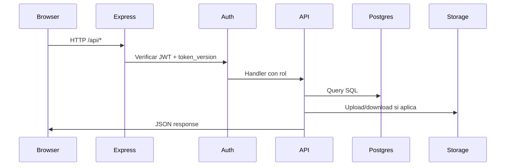

# Arquitectura del sistema

Visión técnica de GymApure v2.5.0.

---

## Stack

| Capa          | Tecnología                                     |
| ------------- | ---------------------------------------------- |
| Frontend      | React 19, Vite, Tailwind CSS, React Query      |
| Backend       | Express (TypeScript), bundle con esbuild       |
| Base de datos | PostgreSQL (Supabase)                          |
| Storage       | Supabase Storage (buckets privados)            |
| Auth          | JWT en cookie/httpOnly + `token_version` en BD |
| Tiempo real   | WebSocket (`wsServer.ts`) para chat            |
| PWA           | Service Worker (`public/sw.js`)                |

---

## Flujo de una petición



En desarrollo, Vite sirve el frontend con HMR en el mismo proceso Express (`server.ts`).

En producción, Express sirve `dist/` estático tras `npm run build`.

---

## Autenticación y RBAC

- Login → JWT firmado con `JWT_SECRET` en cookie httpOnly (8h TTL)
- Cada usuario tiene `token_version` en BD; **cada login y logout lo incrementa** (sesión única)
- También incrementa en: cambio/reset de contraseña, desactivación de cuenta
- Middleware `authenticate` verifica JWT + `token_version` contra BD en cada request
- Cache de sesión in-process **45s TTL** (`sessionUserCache.ts`); si hay `REDIS_URL`, también se comparte en Redis
- Hit rate expuesto en `GET /api/health/metrics` → `sessionCache` (meta operativa ≥85% en pico)
- Entrenadores: `trainerAccess.ts` limita a miembros asignados
- WebSocket: mismo JWT; evento `session:revoked` al iniciar sesión en otro dispositivo

---

## Cachés y rendimiento

| Capa                           | TTL / comportamiento                                |
| ------------------------------ | --------------------------------------------------- |
| Session user (`token_version`) | 45s memoria + Redis opcional                        |
| Admin stats                    | 75s in-process; `?parts=kpis\|charts\|lists`        |
| React Query (default)          | staleTime 60s; poll reducido si Socket.IO conectado |
| Redis                          | rate-limit, login lockout, session cache            |

### Contratos de listados paginados

Por defecto muchos listados devuelven `PaginatedResult`:

```json
{ "items": [], "total": 0, "page": 1, "pageSize": 50 }
```

Parámetros: `page`, `pageSize` (o `limit`), `q` (búsqueda).

**Compatibilidad:** catálogos de ejercicios y rutinas aceptan `?all=1` (tope servidor) para pickers que necesitan el array plano.

Endpoints clave: `/api/exercises`, `/api/routines`, `/api/users`, `/api/payments`, `/api/chat/conversations`.

Validación: `npm run db:audit-query-patterns` (servidor arriba) y `npm run test:pagination-contracts`.

---

## Crons (servidor)

| Cron           | Archivo               | Función                               |
| -------------- | --------------------- | ------------------------------------- |
| Vencimientos   | `expiryCron.ts`       | Avisos al chat (batch + concurrencia) |
| Tasa BCV       | `exchangeRateCron.ts` | Actualiza USD/VES                     |
| Retención logs | servidor              | Limpia audit/expiry logs antiguos     |

Opcional en Render: Cron Job externo con `CRON_SECRET` → `POST /api/settings/expiry/run`.

---

## Storage buckets

| Bucket             | Uso                   |
| ------------------ | --------------------- |
| `payment-proofs`   | Comprobantes de pago  |
| `avatars`          | Fotos de perfil       |
| `exercise-videos`  | Videos de ejercicios  |
| `equipment-photos` | Fotos de equipamiento |

Acceso solo vía backend con `SUPABASE_SERVICE_ROLE_KEY`.

---

## Estructura de carpetas clave

```
server.ts           → Entry point
src/App.tsx         → Rutas React + guards
src/api/            → Routers Express
src/pages/          → Pantallas
src/hooks/queries/  → React Query
supabase/migrations/ → Esquema SQL
```

---

## Enlaces

- [Desarrollo](../DESARROLLO.md)
- [Migraciones y BD](./MIGRACIONES-Y-BD.md)
- [Variables de entorno](./VARIABLES-ENTORNO.md)
